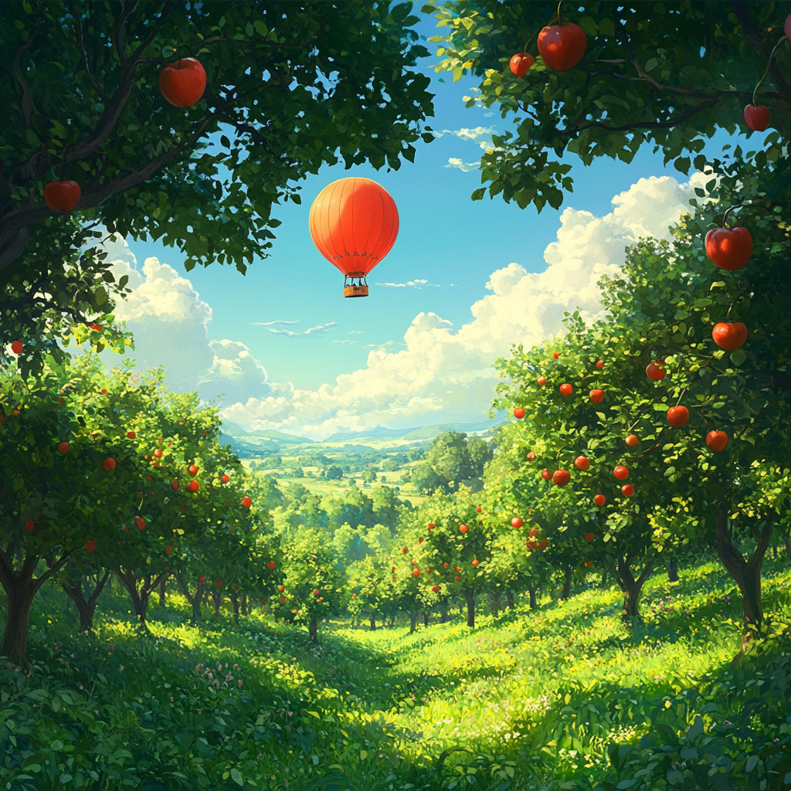

> Science, before 1800, was like an orchard: tame, well laid-out and ordered; fragrant and fruit-bearing. One could wander through it from end to end observing its various parts; and from a neighboring hill, one might even see the entire scheme, and appreciate it.
>
> But by 1800, the wanderers noted that the busy planters, gardeners and cultivators had done their work so well that parts of it had grown dark and foreboding. Order was still there, indeed the intricate network of relationships was more refined, more subtle and more fascinating than ever; but the proliferating branches had begun to shut out the sky.
>
> And then there came the shock of realizing that the orchard was too large. One could no longer pass through it from end to end—not without getting lost and walking in circles back to one's starting point. Nor was the neighboring bill any longer of use, for it, too, was covered by orchard now.
>
> So some of the observers, some of the lovers of the beauty of order, abandoned the orchard altogether; while others compromised by confining themselves to narrow sections of the orchard, then to narrower sections and still narrower sections.
>
> Now, the orchard of science is a vast globe-encircling monster, without a map, and known to no one man; indeed, to no group of men fewer than the whole international mass of creative scientists. Within it, each observer clings to his own well-known and well-loved clump of trees. If he looks beyond, it is usually with a guilty sigh.
>
> _- Isaac Asimov (1963)_

Founded in 2013, [bioRxiv](https://www.biorxiv.org) has emerged as the de facto preprint server for the life sciences. It has gained widespread adoption across nearly every field of biological research. The number of preprints has grown exponentially—now totaling over 250,000 original studies. This represents a challenge and an opportunity.

As Asimov beautifully described over sixty years ago, no scientist can ever explore the entire oRchard of science themselves. This firehose of new findings is evidence of this fact.

But we now have the tools to produce a map of the territory. bioRxiv provides a robust [API](https://api.biorxiv.org/) for programmatically mining the contents of the server. As artificial intelligence continues to master natural language, powerful embedding models have emerged that are capable of finding structure in massive corpuses of text. Modern Web browsers can now render interactive visualizations with millions of data points.

oRchard is an attempt to synthesize these advances and create a living map of bioRxiv. It is built on a [Nomic embedding](https://arxiv.org/abs/2402.01613) of the entirety of bioRxiv. Portions—or the entirety—of the embedding can be explored with a [WebGL-powered scatterplot](https://github.com/flekschas/regl-scatterplot) originally developed by Fritz Lekschas.

The application consists of three integrated tools:

1. **Search:** kNN search of the embedding space (most granular)
2. **Study:** selecting topics of varying depth produced from the Nomic embedding (mid-range)
3. **Scan:** exploring search results, topics, or the entirety embedding space in an interactive visualization (30,000 foot view)

My hope is that this tool will help reveal [new research patterns](https://doi.org/10.1016/j.patter.2024.100968) and help scientists [pick better problems](https://doi.org/10.1016/j.cell.2024.03.012).

**Enjoy the [View From a Height](https://en.wikipedia.org/wiki/View_from_a_Height).**
